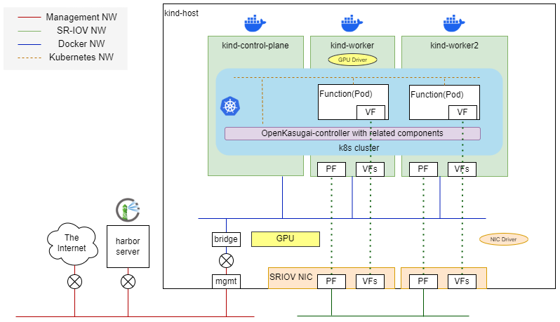

# OpenKasugai-all-in-one

OpenKasugai-all-in-one is a tool that builds an OpenKasugai-controller execution environment on one physical node.

It is intended to be used for demonstrations and controller development.

This uses [Kind](https://kind.sigs.k8s.io/) technology, helps enables to build images required for controller execution, create and delete clusters, and execute scenarios.

For scenario execution, it can be executed the following scenarios described in "Additional Scenario Design for OpenKasugai-controller".

1. Four arithmetic operation scenarios
2. Video inference scenarios

# Architecture

This is a diagram of the environment built by all-in-one below.

To execute the program, kind-host, harbor server, and physical network must be prepared.

kind-host is a general-purpose server connected to the following accelerators.

- NVIDIA GPU (x1)
- NICs supporting SR-IOV (x2)

The user needs to set up a local container registry themselves. You must register the container images for the OpenKasugai-controller that are required by the containers on the kind-host. This document assumes that `harbor` is being used.

The following two types of physical networks need to be prepared.

- Management NW
    - Connects kind-host and harbor server
    - Provides access to the Internet
- SR-IOV NW
    - Connects the PFs on kind-host
    - Used as the 2nd NIC of the Pod for communication between Functions

The all-in-one program runs on kind-host. When the program is run, the k8s cluster, OpenKasugai controller, and related components will be automatically started on the Docker container, and a virtual NW (Docker NW, Kubernetes NW) be set up.
The GPU, PFs, and VFs on kind-host are attached to the container that runs as a worker. This enables to execute of the GPU Function required by the scenario and communicate between Functions using SR-IOV.
The GPU driver need to execute on the first kind worker to simulate a GPU-equipped server.
It on kind-host to run SR-IOV NIC driver and create VFs.

# Installing OpenKasugai-all-in-one

The following document describes the details of the hardware/software/network required for preparation and the procedure for running the program.

[INSTALL MANUAL](./docs/InstallManual/en/INSTALL.pdf)

# Scenario execution using OpenKasugai-all-in-one

The following document describes the procedure for running the scenario in the constructed environment.

[RUNNING SCENARIOS](./docs/Demonstrations/en/RUN_SCENARIOS.pdf)

# Restrictions

- This document is written under the assumption that there are two worker containers and two SR-IOV NICs.
    - Operational checks were also performed with the above configuration.
- Only one worker can use the GPU function (kind-worker).
    - The GPU driver cannot be executed on the host. When building a cluster, need to unload the NVIDIA GPU driver.
- FPGA Function execution is not supported

# License

The Apache License, Version 2.0
