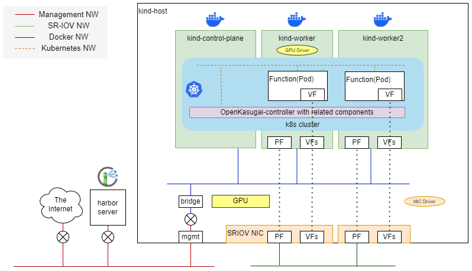

# OpenKasugai-all-in-one

OpenKasugai-all-in-oneは、OpenKasugai-controllerの実行環境を1物理ノードで構築するツールである。
デモンストレーションの実施やコントローラの開発に利用することを目的としている。
[Kind](https://kind.sigs.k8s.io/) の技術を利用しており、コントローラ実行に必要なイメージのビルド、クラスタの作成、削除、シナリオの実行が可能である。

シナリオ実行については、「OpenKasugai-controllerの追加シナリオ設計」に記載された以下シナリオの実行が可能である。

1. 四則演算シナリオ
2. 映像推論シナリオ

# アーキテクチャ

以下はall-in-oneが構築する環境の構成図である。
プログラム実行には、kind-host、harbor server、そして物理ネットワークを用意する必要がある。

kind-hostは、以下のアクセラレータを接続した、汎用サーバである。
- NVIDIA GPU x 1
- SR-IOVをサポートしたNIC x 2

ローカルなコンテナレジストリはユーザが自分で用意する必要がある。kind-host上のコンテナが必要とするOpenKasugai-controllerのコンテナイメージを登録すること。本ドキュメントでは`harbor`を使用している前提で記載する。

物理ネットワークとしては、以下の2種を用意する。

- Management NW
    - kind-hostとharbor serverを接続
    - インターネットへのアクセスを提供
- SR-IOV NW
    - kind-hostのPFを接続
    - Podの2nd NICとして、Function間の通信に使用

all-in-oneのプログラムは、kind-host上で実行する。プログラムを実行すると、Dockerコンテナ上で、k8sクラスタ、OpenKasugaiコントローラ、関連コンポーネント群を自動起動し、仮想NW（Docker NW、Kubernetes NW）を設定する。
kind-host上のGPU、PF、VFは、ワーカとして動作するコンテナへアタッチする。これにより、シナリオが必要とする、GPU Functionの実行と、SR-IOVを用いたFunction間の通信を可能としている。
GPUドライバは、GPU搭載サーバを疑似的に再現するために、kind workerの一台目で実行する。
SR-IOV NICのドライバ実行とVFの作成は、kind-host上で行う。

# OpenKasugai-all-in-oneのインストール

以下ドキュメントに、準備に必要なハードウェア／ソフトウェア／NWの詳細と、プログラム実行の手順について記載している。

[INSTALL MANUAL](./docs/InstallManual/jp/INSTALL.pdf)

# OpenKasugai-all-in-oneを用いたシナリオ実行

以下ドキュメントに、構築した環境でのシナリオ実行手順について記載している。

[RUNNING SCENARIOS](./docs/Demonstrations/jp/RUN_SCENARIOS.pdf)

# 制約事項

- 本ドキュメントは、ワーカコンテナ及びSR-IOV NICをそれぞれ2台とする前提で記載している。
    - 動作確認も上記の構成で実施している。
- GPU Functionが利用可能なワーカは1台のみである（kind-worker）
    - ホスト上でGPU Driverの実行は不可。クラスタ構築時、NVIDIA GPU Driverはアンロードする。
- FPGA Functionの実行は未サポートである

# ライセンス

The Apache License, Version 2.0
